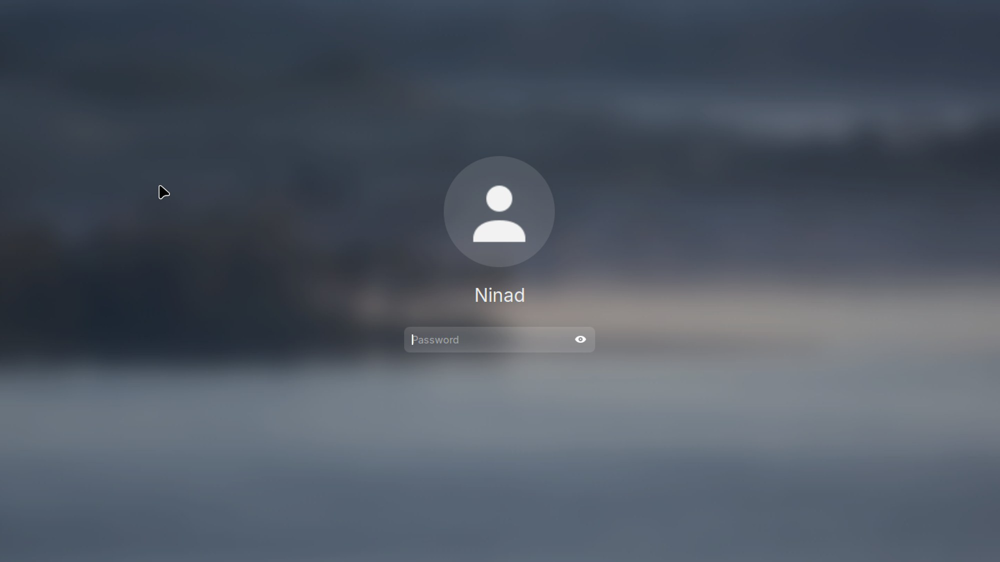

**Applies to:** Desktop

The login screen can offer "Nubo Account" as a way in. You get a short code and a QR code on the screen, approve it on your phone or another computer, and the desktop opens. This is early access.

:::caution[Early access]
Sign-in with a Nubo account has not been approved end to end with a real account yet. Keep a normal local password on the machine as well, and do not rely on this as your only way in.
:::



The screenshot shows the standard password prompt. The Nubo Account option is reached from this screen as described below.

## Before you begin

- A Nubo OS desktop that was installed from the image (not the live session). The sign-in setup never runs on the installation media.
- An internet connection. The setup needs it to reach `mail.nubo.email` and to fetch the sign-in connector.
- A Nubo account (see [What is a Nubo account?](/desktop/account/what-is-a-nubo-account/)) and a phone or another computer with a browser to approve the code.
- The `nubo-account` package, which `nubo-desktop` installs.

## How the setup happens

You do not need to run anything. On the first boot with a network, a system service called `nubo-account-setup` does these things:

1. Checks that `https://mail.nubo.email` offers device sign-in. If not, it waits and tries again on the next boot.
2. Installs the sign-in connector `authd-oidc`. This connector is distributed as a snap, which is why `snapd` stays on the desktop. Nubo OS does not use snaps for apps. See [Install and remove apps](/desktop/apps/install-and-remove-apps/).
3. Writes the connector's configuration, pointing it at `mail.nubo.email`.
4. Records success in `/var/lib/nubo/account-setup-done`, after which it does not run again.

If the machine was offline at first boot, nothing is broken. The service retries on every boot until it succeeds.

## Sign in

1. At the login screen, choose the option for a user that is not listed. <!-- verify label: the repo says 'Not listed?' -->
2. Enter your Nubo email address.
3. Pick **Nubo Account** from the list of sign-in methods. <!-- verify label -->
4. The screen shows a short code, a web address and a QR code.
5. On your phone or another computer, open the address (or scan the QR code), enter the code and approve.
6. Wait a moment. The desktop session opens.

## Who may sign in

The first Nubo account that signs in becomes the owner of the machine. It is added to the `sudo` and `lpadmin` groups, so it can administer the computer. Everyone else is refused until the owner allows them. This is the `allowed_users = OWNER` setting in the connector's configuration.

## Verify

- The service finished: `ls /var/lib/nubo/account-setup-done` shows the file.
- The connector is installed: `snap list authd-oidc` lists it.
- The login service knows the method: the file `/etc/authd/brokers.d/nubo.conf` exists and names "Nubo Account".

```bash
snap list authd-oidc
systemctl status snap.authd-oidc.authd-oidc.service
```

## Troubleshooting

**The login screen does not offer "Nubo Account".** The setup has not finished. Check `ls /var/lib/nubo/account-setup-done`. If the file is missing, you were probably offline. Connect, restart the computer, and check again. You can read progress with `journalctl -u nubo-account-setup`.

**The log says "Nubo SSO not reachable".** The computer could not fetch `https://mail.nubo.email/.well-known/openid-configuration`, or the answer had no device sign-in. Check your network, then restart. If the network is fine, the server may be down. Write to support@nubo.email.

**The log says "sign-in connector not installed yet".** The snap could not be downloaded. The service tries again at the next boot. Check that `snapd` is running.

**The code expires before you approve.** The code is valid for a limited time. Start again to get a new one.

**Your account is refused after approval.** Only the owner may sign in until the owner allows others. Sign in with the owner account or a local user.

## See also

- [Account security](/desktop/account/account-security/)
- [Add your Nubo account to Online Accounts](/desktop/account/online-accounts/)
- Ubuntu's documentation for the login service this builds on: https://ubuntu.com/desktop/docs
