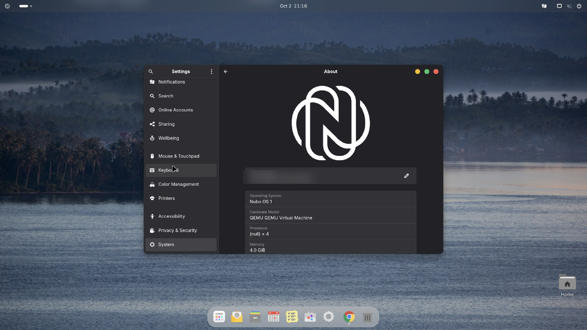

**Applies to:** Desktop

A live session runs the whole desktop from the USB stick. Nothing is written to your computer's disk unless you choose to install. The live session already has the Nubo packages installed, so what you see is what the installed system looks like.

## Before you begin

- A computer that can boot from USB. Check [System requirements](/start/system-requirements/).
- A USB stick with the Nubo OS installer written to it. See [Write the installer to a USB stick](/desktop/get-started/write-the-installer-usb/).
- Time to find your computer's boot menu key. It is usually <kbd>F12</kbd>, <kbd>F10</kbd>, <kbd>F2</kbd>, <kbd>Esc</kbd> or <kbd>Del</kbd>, and it varies by maker.

:::note
Secure Boot works. The boot loader and kernel on the image are Ubuntu's signed ones, so you do not need to turn Secure Boot off.
:::

## Steps

1. Save your work and shut the computer down.
2. Plug in the USB stick.
3. Turn the computer on and press the boot menu key repeatedly while the maker's logo shows.
4. Choose the USB stick in the list. It may appear twice, once as a UEFI entry. Choose the UEFI one.
5. In the boot menu that appears, choose the option to try Nubo OS without installing. The boot menu and the volume name say Nubo OS. The exact wording of the options comes from Ubuntu's image. <!-- verify label -->
6. Wait for the desktop. You see the Nubo wallpaper, the top bar with the Nubo logo, and the dock.
7. Look around. Open the overview by clicking the Nubo logo at the top left. Open Nubo Search with <kbd>Super</kbd>+<kbd>Space</kbd>.

## What to test

Use the live session to check what matters on your hardware:

- Wi-Fi: can you see and join your network?
- Sound: does the volume control make a noise?
- Display: does the screen use its full resolution, and does the brightness work?
- Touchpad and keyboard, including special keys.
- Suspend, if you plan to use it on a laptop.

## What does not work the same

The live session is temporary. Settings, files and apps you add are lost when you restart. Some first-boot jobs are skipped on the installation media on purpose: the cleanup that replaces Ubuntu's store snaps, the app downloads from Flathub and the Nubo account setup do not run in the live session. Apps such as Firefox, which arrive from Flathub, therefore are not there yet. They arrive after you install and start the installed system with a network.

## Verify

You know it worked when you reach the desktop, and Settings then About shows "Nubo OS 1" as the operating system. <!-- verify label -->

## Troubleshooting

- **The computer starts its old system instead.** The boot menu key was missed. Restart and press it earlier, or turn on USB boot in the firmware settings.
- **The stick does not appear in the boot menu.** Rewrite it, using a different USB port. See [Write the installer to a USB stick](/desktop/get-started/write-the-installer-usb/). Make sure the firmware is in UEFI mode.
- **A black screen after the boot menu.** Wait a minute. If it stays black, restart and try again. If it repeats, see [Boot problems](/desktop/troubleshooting/boot-problems/).
- **The screen flickers or looks wrong in a virtual machine.** See [Display flickers or resizes in a VM](/desktop/troubleshooting/display-flickers-or-resizes-in-a-vm/).

## See also

- [Install Nubo OS on a PC](/desktop/get-started/install-on-a-pc/)
- [Boot problems](/desktop/troubleshooting/boot-problems/)
