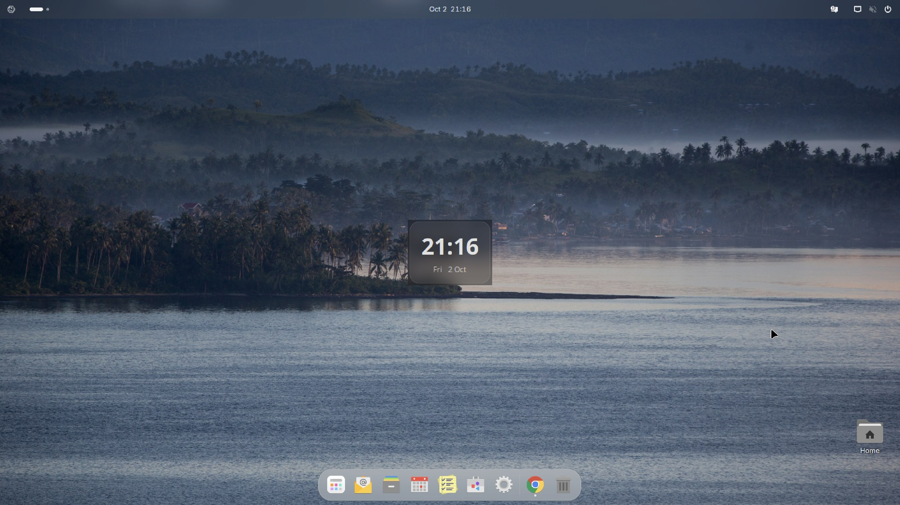

**Applies to:** Desktop

The Nubo OS desktop is GNOME 50 on Ubuntu 26.04 LTS, with the Nubo glass theme, a floating dock, a notification centre, desktop widgets, the Nubo Search launcher, and a curated set of apps. These docs are organized by what you want to do.

## Get started

Download, try, install and take your first steps: [Get started](/desktop/get-started/).

## Use the desktop

Everyday use of the top bar, dock, overview, notifications, widgets and search: [Use the desktop](/desktop/use/).

## Your account

Signing in, user accounts and the Nubo account: [Account](/desktop/account/).

## Apps

What comes installed, how to get more apps from Flathub, and how the grey icons work: [Apps](/desktop/apps/).

## Settings

Appearance, keyboard, display, sound and the rest of Settings: [Settings](/desktop/settings/).

## Troubleshooting

Something is wrong? Start with the symptom: [Troubleshooting](/desktop/troubleshooting/).

## Other sections

- [Start](/start/) for the welcome page, FAQ and glossary.
- [Updates](/updates/) for update channels and the package archive.
- [Server](/server/) for the server editions.
- [Reference](/reference/) for commands, packages and paths.

## Status

Nubo OS 1 is in beta. Features that are not built are marked **Planned** in these docs. The desktop image for real hardware is not yet built by the automated pipeline, so install instructions describe the image as produced by the repository's build script.
