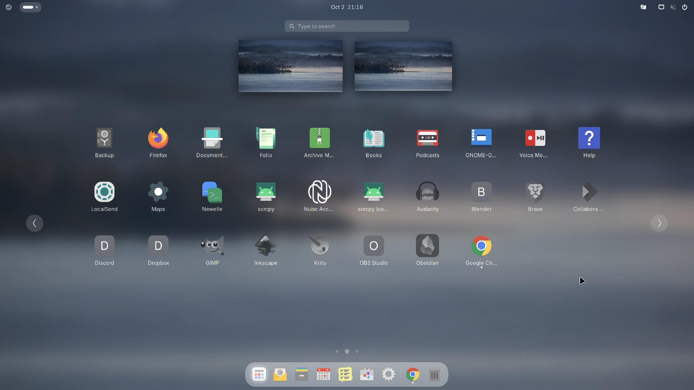

**Applies to:** Desktop

Most apps on Nubo OS come from two places: Ubuntu's archive (installed with `apt`) and Flathub (installed with Flatpak). The grey icons in the app grid are placeholders for Flathub apps that you have not installed yet. This page covers the common causes when an app does not open or is missing.

## Before you begin

- A network connection. Downloads from Flathub need it. See [Wi-Fi and network problems](/desktop/troubleshooting/wifi-and-network/).
- A terminal.

## Steps

### A grey icon does nothing

A grey icon runs `nubo-get`, which downloads the app from Flathub and then opens it. A small progress window titled "Nubo Store" appears while it works.



1. Check your network. If the download fails, you see a message with the text "Could not download" and a hint to check your internet connection.
2. Try again after a minute. Flathub may be busy.
3. Run it from a terminal to see the error. Use the app's Flathub ID, for example for GIMP:

   ```bash
   nubo-get org.gimp.GIMP
   ```

4. Check that Flathub is set up:

   ```bash
   flatpak remotes
   ```

   You should see `flathub`. If it is missing, add it:

   ```bash
   flatpak remote-add --if-not-exists flathub https://dl.flathub.org/repo/flathub.flatpakrepo
   ```

### Firefox, Collabora Office or another first-boot app is missing

These arrive from Flathub on the first boot, one at a time. If the network was missing, the job retries on the next boot.

1. Connect to a network and restart.
2. Wait a few minutes and open the app grid again.
3. See what the job did:

   ```bash
   journalctl -u nubo-first-boot
   ls /var/lib/nubo/
   ```

   When `first-boot-done` is present, it has finished. A log line such as `not available for this CPU, skipped` means the app does not exist for your processor. Spotify, for example, exists only for x86.

4. To install one yourself:

   ```bash
   flatpak install --system flathub org.mozilla.firefox
   ```

### An installed app will not start

1. Start it from a terminal to see the error. For a Flatpak app:

   ```bash
   flatpak run org.videolan.VLC
   ```

   For an app from the archive, run its command name.

2. Update Flatpak apps:

   ```bash
   flatpak update
   ```

3. For an app from the archive, update the system:

   ```bash
   sudo apt update && sudo apt upgrade
   ```

4. If a Flatpak app is damaged, reinstall it:

   ```bash
   flatpak uninstall org.videolan.VLC
   flatpak install flathub org.videolan.VLC
   ```

### An app is missing from the grid

Nubo hides a few apps from the launcher on purpose, such as Maps, the Extension Manager and Yelp. They are still installed. Some tools sit inside folders such as Utilities and Accessories. Use Nubo Search (<kbd>Super</kbd>+<kbd>Space</kbd>) to find an app by name.

### A grey icon is still shown after the app is installed

The grey launchers are redrawn when you log in, and when the list of Flatpak apps changes. Sign out and back in, or run:

```bash
/usr/libexec/nubo/nubo-app-stubs
```

## Verify

The app opens, and its icon in the grid is in color, not grey.

## Troubleshooting

- **"Could not download" every time.** The network may block `dl.flathub.org`. Check with `curl -I https://dl.flathub.org`.
- **Disk full.** Free some space. Flatpak apps need room.
- **An app opens and closes at once.** Run it from a terminal. A sandbox problem shows a message there.
- **LibreOffice is gone.** That is deliberate. Nubo OS replaces it with Collabora Office.
- **You want an app Nubo does not list.** Use GNOME Software from the dock, or the commands above with the app's Flathub ID.

## See also

- [Apps](/desktop/apps/)
- [Collect logs for support](/desktop/troubleshooting/collect-logs-for-support/)
