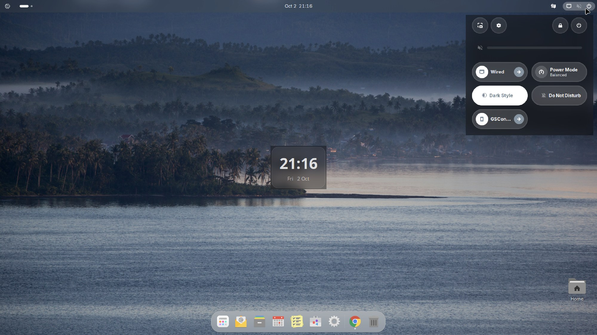

**Applies to:** Desktop

Nubo OS uses PipeWire with WirePlumber for sound, as Ubuntu does. The `nubo-desktop` package pulls in `pipewire-pulse`, `wireplumber` and the ALSA tools. If you hear nothing, the cause is usually a muted output, the wrong output device, or a virtual machine without a sound device.

## Before you begin

- Check the obvious: volume knob or key on your speakers, headphone plug fully in, laptop mute key.
- You can open a terminal. Use Nubo Search (<kbd>Super</kbd>+<kbd>Space</kbd>) and type Terminal.

## Steps

### 1. Check the volume in quick settings

Click the status icons at the top right. The volume slider is near the top of the menu. In the Nubo screenshots the speaker icon at the top bar shows a mute mark, which means the output is muted. Drag the slider up, and click the speaker icon to unmute.



### 2. Choose the right output

Open Settings and then Sound. <!-- verify label --> Under Output, choose the device that matches what you use: built-in speakers, headphones, HDMI or a USB or Bluetooth device. Play a test sound if the page offers one.

### 3. Check that the sound server runs

```bash
systemctl --user status pipewire wireplumber pipewire-pulse
```

All three should be `active (running)`. If one is not, restart them:

```bash
systemctl --user restart pipewire pipewire-pulse wireplumber
```

### 4. List the devices PipeWire sees

```bash
wpctl status
```

Look under Sinks for your device. A star marks the default. To make another device the default, note its number and run:

```bash
wpctl set-default 52
wpctl set-mute @DEFAULT_AUDIO_SINK@ 0
wpctl set-volume @DEFAULT_AUDIO_SINK@ 0.7
```

Replace `52` with the number from your list.

### 5. Check the hardware level

```bash
aplay -l
```

This lists the sound cards the kernel found. If the list shows "no soundcards found", the kernel does not see a sound device. In a virtual machine, add an audio device in the host tool's settings (for example an Intel HDA device), then restart the VM.

### 6. Check the ALSA mixer

```bash
alsamixer
```

Press <kbd>F6</kbd> to choose the card. Channels that show `MM` are muted; select one and press <kbd>M</kbd> to unmute it. Use the arrow keys to raise the volume.

## Verify

Play a sound in an app, or open Settings, then Sound, and use its test option. <!-- verify label --> You hear it.

## Troubleshooting

- **Headphones work but speakers do not, or the reverse.** Pick the right output in Settings, then Sound. Some laptops list headphones and speakers as separate ports.
- **HDMI has no sound.** Select the HDMI output in Settings, then Sound. The display must support audio.
- **Bluetooth headphones connect but are silent.** Disconnect and reconnect them, and choose them as the output.
- **System sounds are silent, but apps play.** Nubo uses its own sound theme (`Nubo`, based on the Ocean theme). Check that "Do Not Disturb" is not on and the alert volume is up. <!-- verify label -->
- **No sound card in a VM.** Add an audio device to the VM in the host tool.
- **None of this helps.** Collect logs and write to support. See [Collect logs for support](/desktop/troubleshooting/collect-logs-for-support/).

## See also

- [Settings](/desktop/settings/)
- [Reset desktop settings](/desktop/troubleshooting/reset-desktop-settings/)
- [Ubuntu Desktop documentation](https://ubuntu.com/desktop/docs)
