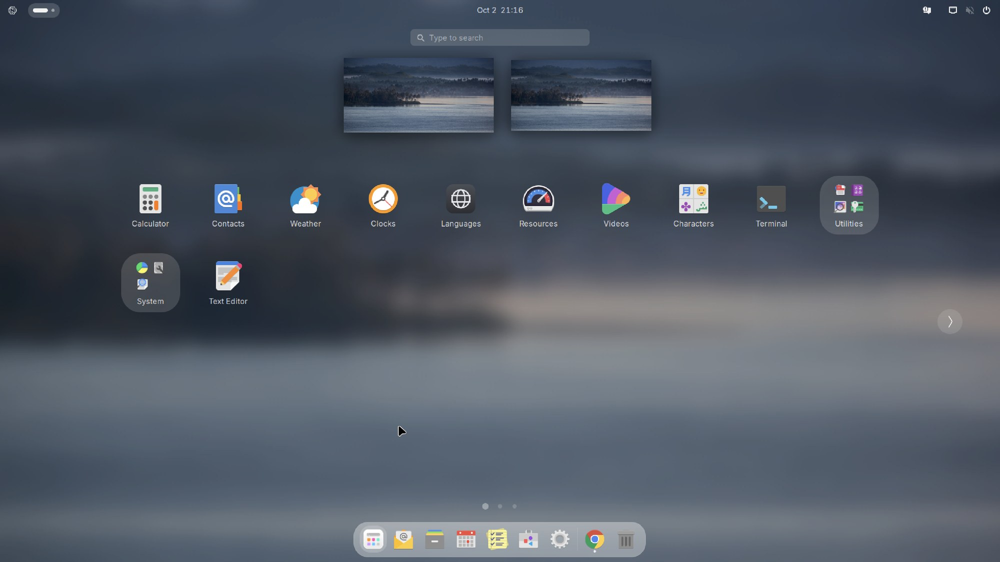

**Applies to:** Desktop

The dock holds the apps you use most. The app grid shows everything that is installed, plus a few apps that are one click away from being installed. This page explains both and shows how to arrange them.

## The dock

The dock floats at the bottom of the screen, centered, and is only as wide as its icons. It is the Dash to Dock extension, configured by Nubo:

- The grid button is at the left end of the dock.
- Icons are at most 44 pixels.
- The background is a frosted glass panel at 35 percent opacity.
- The Trash is on the right. Mounted drives are not shown in the dock.
- The dock stays visible; it does not hide when a window covers it.

Out of the box, the pinned apps are Firefox, Mail (Geary), Files, Calendar, Reminders, Nubo Store and Settings. Apps that are running but not pinned appear next to them with a small dot.

### Pin, unpin and reorder

1. Open the app grid.
2. Right-click an app and choose the option to add it to favorites (the label can vary by version). <!-- verify label -->
3. To remove it, right-click its dock icon and choose the option to remove it from favorites. <!-- verify label -->
4. To reorder, drag an icon along the dock.

## The app grid

Open the grid with the dock's grid button, the Nubo logo at the top left, or <kbd>Super</kbd>. Nubo sets the grid to at most seven icons across and four rows per page (the App Grid Tuner extension's defaults); the actual layout can differ with screen size. Page dots at the bottom show how many pages there are. Scroll, swipe or use the arrow at the side to change page.

Type while the grid is open to search. For a quicker, wider search see [Nubo Search](/desktop/use/nubo-search/).

### Folders

Nubo ships three folders so the first page shows everyday apps and tools stay out of the way:

| Folder | What goes in it |
|---|---|
| Utilities | Languages, Resources, Characters, Disk Usage, Disks, Logs, Fonts, Archive Manager, Backup, Passwords and Keys, Terminal, LocalSend |
| Accessories | Document Scanner, Calculator, Voice Memos, Clocks, Text Editor |
| More apps | The grey placeholder apps that are not on the machine yet (see below) |

The list comes from the file `data/dconf/nubo-app-folders` in the Nubo OS source. An app is shown in a folder only if it is installed, so your folders may hold fewer entries. Rename or reorganize folders by dragging apps in and out. <!-- verify label: some of these names are renamed entries and show with the Nubo name -->

To create your own folder, drag one icon onto another. To remove a folder, drag all its apps out.

## Grey placeholder icons

Some well-known apps are shown in grey even though they are not installed. Clicking a grey icon:

1. Shows a small progress window titled Nubo Store while the app downloads from Flathub.
2. Starts the app when the download finishes.
3. Replaces the grey icon with the real one. The grey icon disappears once the app exists.

Grey icons are made at login and after each download by `nubo-app-stubs`. The list of apps comes from `/usr/share/nubo/apps/popular.list`. It includes chat, media, work, creative and game apps; examples are Telegram, Signal, Discord, Slack, Zoom, VLC, OBS Studio, GIMP and Steam. A few apps are web apps instead, such as WhatsApp or YouTube; those open the website.

The popular apps that Nubo marks as preinstalled are on the first page. The rest are in the **More apps** folder.

:::note
Nubo does not ship these apps' files in the image. When you click a grey icon, your computer downloads the app from Flathub. You need an internet connection.
:::

## Verify

1. Open the grid. You should see a Utilities folder and an Accessories folder.
2. Click a grey icon of an app you want, for example Signal. A progress window appears.
3. When it is finished, the app opens and the icon is in color.

## Troubleshooting

**Clicking a grey icon shows "Could not download".**
Cause: no internet, or Flathub is not reachable. Fix: check your connection and click again. The message includes the last line of the Flatpak error.

**A grey icon stays after I installed the app another way.**
Cause: the launcher list is refreshed at login. Log out and in. A Flatpak app installed through Nubo Store is detected at once.

**There are no grey icons.**
Cause: `nubo-app-stubs` has not run yet, or the ImageMagick tool it uses for icons is missing, in which case it falls back to plain icons. Log in again.

**The folders are empty or missing.**
Cause: you reset the app grid layout. Open a terminal and run `gsettings reset-recursively org.gnome.desktop.app-folders`, then log out and in. <!-- verify label: Nubo seeds folders as dconf defaults -->

## See also

- [The Nubo menu and top bar](/desktop/use/the-nubo-menu-and-top-bar/)
- [Nubo Search](/desktop/use/nubo-search/)
- [Startup and background apps](/desktop/settings/startup-and-background-apps/)
- [Default apps](/desktop/settings/default-apps/)
