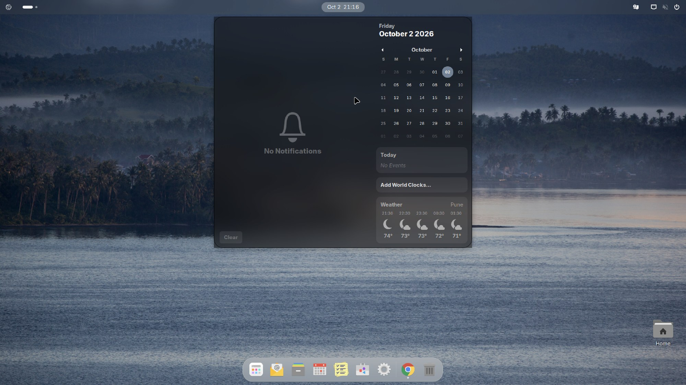

**Applies to:** Desktop

The top bar is the thin strip along the top of the screen. It is always there, in the desktop and in the overview. This page explains each part of it and how Nubo differs from stock GNOME.

## The Nubo logo at the left

At the far left of the bar you see the Nubo logo with the text "Nubo OS 1". It is added by a Nubo GNOME Shell extension (`nubo-menu@nubosuite.tech`).

Clicking the logo does one thing: it opens or closes the Activities overview, which shows your open windows, a search field and the app grid. It works like a start button. There is no drop-down menu behind it. A touch on a touch screen does the same.

You can reach the same overview with the <kbd>Super</kbd> key, the app grid button at the left end of the dock, or a hand gesture on a touchpad if your hardware supports it.

<!-- verify label: the gesture is a GNOME touchpad default; not tested on every touchpad -->

## Workspace indicator

Next to the logo is a small indicator made of a long pill and dots. Each shape is a workspace; the long pill is the one you are on. Click one to switch. See [Windows and workspaces](/desktop/use/windows-and-workspaces/).

## The clock and the calendar panel

The date and time sit in the middle. Click them to open the calendar panel. It combines:

- the notifications that GNOME is holding, with a **Clear** button;
- a month calendar;
- **Today**, which lists events from your calendar apps (it shows "No Events" when there are none);
- **Add World Clocks...**;
- **Weather**, with an hourly forecast for a place, when the Weather app knows a location.

The panel is stock GNOME. Nubo adds a second notification surface, the history panel described in [Notifications](/desktop/use/notifications/).

## Status area at the right

The right end of the bar holds the status area. In the default build it contains:

- the **Nubo notification history** button (a bell with an unread count);
- the **input source** indicator when you have more than one keyboard layout;
- the **quick settings** button, a group of icons for network, sound and power.

Click the group to open [Quick settings](/desktop/use/quick-settings/).

<!-- verify label: exact icon order and whether the bell shows when notification history is empty -->

## Appearance

The bar is 40 pixels tall. It is frosted glass: the wallpaper shows through a blur, with a faint white tint and a little grain. The blur comes from the Blur my Shell extension, configured by Nubo. In the overview the blur is turned off so thumbnails stay sharp.

If you prefer a plain bar, you can turn off the Blur my Shell extension in the Extensions app, if it is installed. <!-- verify label: Extensions app is hidden from the launcher on Nubo OS (org.gnome.Shell.Extensions is in data/apps/hide.list) -->

## Fonts and cursor

The interface font is Inter, the monospace font is JetBrains Mono, and the pointer is Bibata Modern Classic. The window title font is Inter Bold.

## Verify

1. Look at the top left. You should see the Nubo logo and the text "Nubo OS 1".
2. Click the logo. The overview opens, with a search field at the top and thumbnails of your workspaces.
3. Click the logo again. The overview closes.
4. Click the date and time. The calendar panel opens.

## Troubleshooting

**The logo is missing and the bar starts with the workspace indicator.**
The `nubo-menu` extension is off. Extensions can be turned off by a shell crash recovery or by you. Log out and in again. The session helper adds Nubo's extensions to your list once at login, and does not re-enable one you turned off yourself. To turn it on again, use the Extensions app or, in a terminal, `gnome-extensions enable nubo-menu@nubosuite.tech`.

**The bar is solid grey instead of glass.**
The Blur my Shell extension is off, or your graphics driver cannot render the effect. Turn the extension on first.

**The notification bell is not there.**
Check that `nubo-notify-center@nubosuite.tech` is enabled the same way.

## See also

- [Dock and app grid](/desktop/use/dock-and-app-grid/)
- [Notifications](/desktop/use/notifications/)
- [Light and dark appearance](/desktop/use/light-and-dark/)
- Ubuntu's own desktop documentation: https://ubuntu.com/desktop/docs
