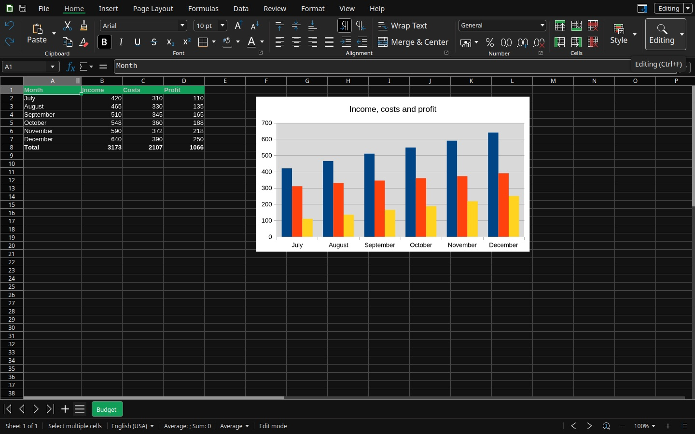

Nubo Cells is for tables of numbers: budgets, lists, calculations and charts. It opens `.xlsx`, `.xls`, `.ods` and `.csv` files. The colour is green.

## The window

- **Tabs:** File, Home, Insert, Page Layout, Formulas, Data, Review, Format, View and Help.
- **Formula bar** under the tabs. The box on the left shows the cell name, such as A1. The bar on the right shows what is in the cell.
- **Grid** with column letters and row numbers.
- **Sheet tabs** at the bottom, with buttons to go to the first, previous, next and last sheet, and to add one.
- **Sidebar** with Style, Character, Number Format and Alignment.
- **Status bar** with the sheet count and a summary of the selected cells, such as Sum and Average.

## The tabs

| Tab | What it is for |
|---|---|
| **Home** | Clipboard, Font, Alignment (including Wrap Text and Merge & Center), Number formats, Cells and Style |
| **Insert** | Pivot Table, Pivot Calculated Field, Table, Illustrations (charts and images), Hyperlink, Date, Time, Define and Manage names, Text, Headers and Footers, Symbol, Comment |
| **Page Layout** | Margin, Size, Orientation, Print Ranges, Right-To-Left, Grid, Row Height, Column Width, Insert, Select All, Align, Arrange |
| **Formulas** | Insert Function, AutoSum, Logical, Date & Time, Math & Trig, Financial, Text, Lookup & Reference, More Functions, Define Range and range tools, Formula to Value, Recalculate |
| **Data** | Sort, Sort Ascending and Descending, AutoFilter, Standard Filter, Advanced Filter, Hide AutoFilter, Reset Filter, Group, Ungroup, Show and Hide Details, Statistics |
| **Review** | Spelling, Language, Auto Spell Check, Hyphenation, Comment, Delete Comment, Delete All Comments, Protect Sheet |
| **Format** | Character, Format, Paragraph, Style list, Format Cells, Line, Position and Size, Sparkline, Themes, Add Theme |
| **View** | Sheet View, Freeze, Focus Cell, Zoom, Compact view, Collapse Tabs, Status Bar, Dark Mode, Invert Background, Sidebar, Navigator |
| **Help** | Online Help, Keyboard shortcuts, Forum, Report an issue, Latest Updates, Screen Reading, About |

The full button list is in the [Nubo Cells ribbon reference](/office/reference/ribbon-cells/).

## What you can do

- **Formulas.** Type a formula in a cell, such as `=SUM(B2:B7)`, or build one with **Insert Function** and the function groups on the Formulas tab. See [Use formulas](/office/guides/cells-formulas/).
- **Charts.** Select a range and add a chart from Insert, Illustrations. See [Make a chart](/office/guides/cells-charts/).
- **Sort and filter.** The Data tab sorts a list and filters it with AutoFilter, Standard Filter or Advanced Filter. See [Sort and filter data](/office/guides/cells-sort-and-filter/).
- **Pivot tables.** Insert a pivot table to summarise a long list.
- **Sparklines and themes.** Small charts inside a cell, and colour themes for the whole sheet, from Format.
- **Protect a sheet** from changes with Review, Protect Sheet.
- **Several sheets** in one file, and **CSV** files that open and save as plain text tables.

## Verify

Type 1, 2 and 3 in cells A1 to A3 and `=SUM(A1:A3)` in A4. The cell shows 6.

## See also

- [Nubo Cells ribbon reference](/office/reference/ribbon-cells/)
- [Build your first spreadsheet](/office/guides/cells-first-spreadsheet/)
