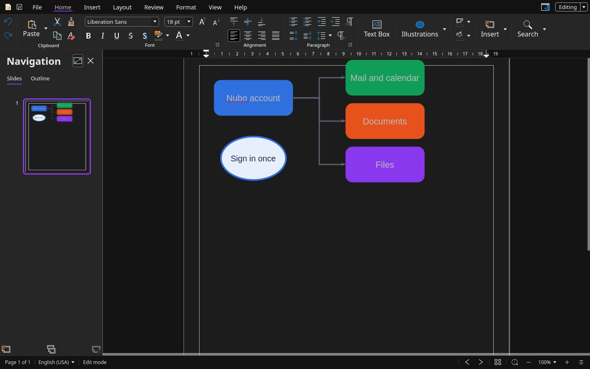

Nubo Draw is for diagrams, flyers, posters and simple drawings. It opens `.odg` and `.vsd` files, and PDF files. The colour is violet.

## The window

- **Tabs:** File, Home, Insert, Layout, Review, Format, View and Help.
- **Navigation pane** on the left. **Slides** lists the pages of the drawing, and **Outline** shows its text.
- **Page** in the middle, with rulers above and beside it.
- **Sidebar** on the right with Page settings: format, orientation, background, margin and master page.
- **Status bar** with the page number and the language.

## The tabs

| Tab | What it is for |
|---|---|
| **Home** | Clipboard, Font, Alignment, Paragraph, Text Box, Illustrations (shapes), line and fill colours, Insert, Search |
| **Insert** | New Page, Duplicate Page, Delete Page, Image, Table, Chart, Shapes, Curve, Line, Hyperlink, Comment, Date and Time fields, Text Box, Vertical Text, Symbol |
| **Layout** | Header and Footer, New Page, Duplicate Page, Page Properties, Page Layout, Select All, Align, Distribute, Arrange |
| **Review** | Spelling, Language, Auto Spell Check, Hyphenation, Comment, Delete All Comments |
| **Format** | Character, Paragraph, Bullets and Numbering, Page Properties, Line, Position and Size, Name, Alt Text, Theme |
| **View** | Full Screen, Reset zoom, Zoom Out, Zoom In, Compact view, Ruler, Status Bar, Collapse Tabs, Grid, Dark Mode, Invert Background, Sidebar, Navigator |
| **Help** | Online Help, Keyboard shortcuts, Forum, Report an issue, Latest Updates, Screen Reading, About |

The full list is in the [Nubo Draw ribbon reference](/office/reference/ribbon-draw/).

## What you can do

- **Draw shapes and add text** inside them or in a text box. Colour them from the Home tab.
- **Connect shapes** with a connector. It stays attached when you move either shape.
- **Align, distribute and arrange.** In the Layout tab, line shapes up, space them evenly and change which one is in front.
- **Work on several pages** in one drawing, with New Page, Duplicate Page and Delete Page.
- **Work with PDF.** Open a PDF to read or mark it up, and export a drawing as PDF. See [Work with PDF files](/office/guides/work-with-pdf/).
- See [Draw a diagram](/office/guides/draw-diagrams/).

## Verify

Open **Insert**, then **Shapes**, and choose a shape. It appears on the page, and you can drag it.

## See also

- [Nubo Draw ribbon reference](/office/reference/ribbon-draw/)
