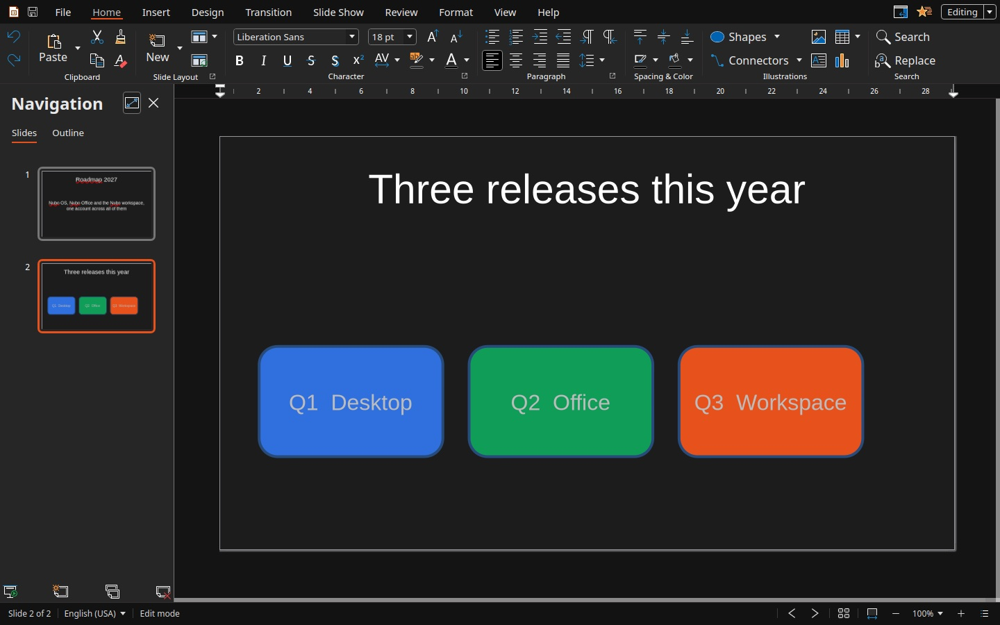

Nubo Present is for talks and slide decks. It opens `.pptx`, `.ppt` and `.odp` files. The colour is orange.

## The window

- **Tabs:** File, Home, Insert, Design, Transition, Slide Show, Review, Format, View and Help.
- **Navigation pane** on the left. **Slides** lists every slide as a thumbnail, and **Outline** shows the text of the deck.
- **Slide** in the middle, with placeholders such as "Click to add Title".
- **Sidebar** on the right. The Slide section sets the format (Screen 16:9 by default), the orientation, the background and the master slide. Layouts below it is a gallery of slide layouts.
- **Buttons under the slide list** for adding, duplicating and deleting slides.
- **Status bar** with the slide number, such as "Slide 2 of 2", and the language.

## The tabs

| Tab | What it is for |
|---|---|
| **Home** | Clipboard, New slide and Slide Layout, Character, Paragraph, Spacing & Color, Shapes, Connectors, Illustrations, Search and Replace |
| **Insert** | New, Duplicate Slide, Delete Slide, Image, Media, Table, Chart, Shapes, Curve, Line, Hyperlink, Comment, Date and Time fields, Text Box, Vertical Text, Header and Footer, Symbol |
| **Design** | Master Slide Templates, Themes, Add Theme, Slide Layout, Slide Size, Slide Properties, Header and Footer, Background Image |
| **Transition** | A gallery of transitions (None, Wipe, Wheel, Uncover and more), Variant, Duration, On mouse click or After a delay, and Apply to All Slides |
| **Slide Show** | From Beginning, From Current Slide, Presenter View, Present in Window, Hide Slide |
| **Review** | Spelling, Language, Auto Spell Check, Hyphenation, Comment, Delete All Comments |
| **Format** | Character, Paragraph, Bullets and Numbering, Slide Properties, Line, Position and Size, Name, Alt Text |
| **View** | Full Screen, Reset zoom, Zoom Out, Zoom In, Compact view, Ruler, Status Bar, Collapse Tabs, Slide Views, Grid, Dark Mode, Invert Background, Sidebar |
| **Help** | Online Help, Keyboard shortcuts, Forum, Report an issue, Latest Updates, Screen Reading, About |

The full list is in the [Nubo Present ribbon reference](/office/reference/ribbon-present/).

## What you can do

- **Pick a layout** for each slide from the Layouts gallery in the sidebar, or with Slide Layout on Home or Design.
- **Add content.** Shapes, connectors, tables, charts, images, media, text boxes and fields from Insert and Home.
- **Change the look of the whole deck** with a theme or a master slide in Design.
- **Move between slides with a transition** chosen in the Transition tab, set to start on a mouse click or after a time.
- **Run the show** from the Slide Show tab: **From Beginning**, **From Current Slide**, **Presenter View** or **Present in Window**. Hide a slide you do not want to show with **Hide Slide**.
- See [Run a slide show](/office/guides/present-transitions-and-slide-show/) and [Make your first presentation](/office/guides/present-first-presentation/).

## Verify

Click **New** on the Home tab. The slide list shows a second slide, and the status bar reads "Slide 2 of 2".

## See also

- [Nubo Present ribbon reference](/office/reference/ribbon-present/)
