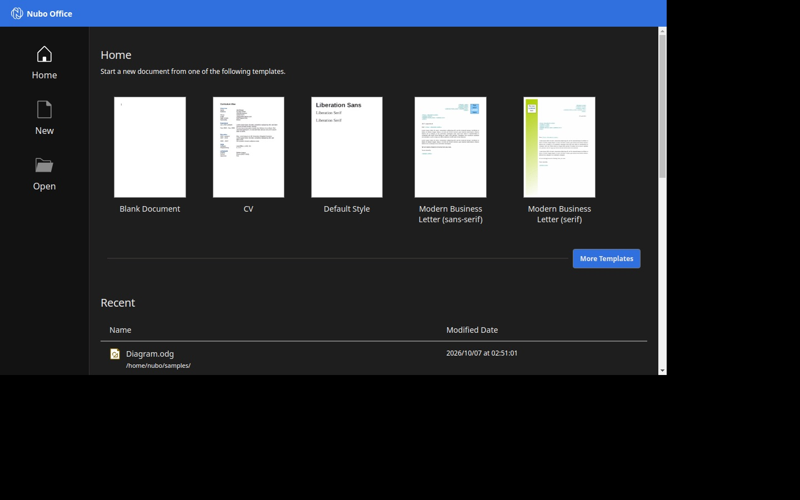
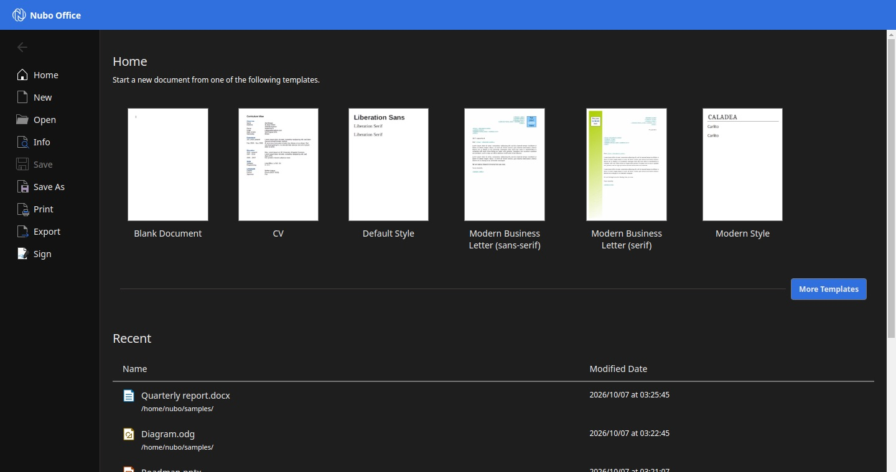

## The start screen

When you open **Nubo Office**, you land on Home. It has:

- **Templates** across the top. For documents they include Blank Document, CV, Default Style, two business letters (sans-serif and serif) and Modern Style. **More Templates** shows the rest. Spreadsheets start from Blank Spreadsheet.
- **Recent**, a list of your latest documents with the folder they are in and when they were last changed.
- A blue header with the Nubo mark. The header takes the colour of the app you are in: the same screen is green in Cells.

## The File menu

Every app has a **File** tab. It opens the same full-page menu, with these entries down the left side:

| Entry | What it does |
|---|---|
| **Home** | Templates and recent documents |
| **New** | Start a new document |
| **Open** | Open a file from your computer |
| **Info** | Details about the current document |
| **Save** | Save the document. Greyed out when there is nothing new to save |
| **Save As** | Save a copy under another name or in another format |
| **Print** | Print the document |
| **Export** | Make a PDF or another format |
| **Sign** | Sign the document |

The arrow at the top left takes you back to the document.

## Start a document

1. Open **Nubo Office** from the app grid.
2. Pick a template, for example **Blank Document**.
3. The matching app opens with its accent colour.

You can also open one app directly. Nubo Write opens on a blank document.

## Verify

The new document opens, and the status bar shows its page or sheet count.

## See also

- [Files and formats](/office/features/formats/)
- [Start an app](/office/use/start-an-app/)
