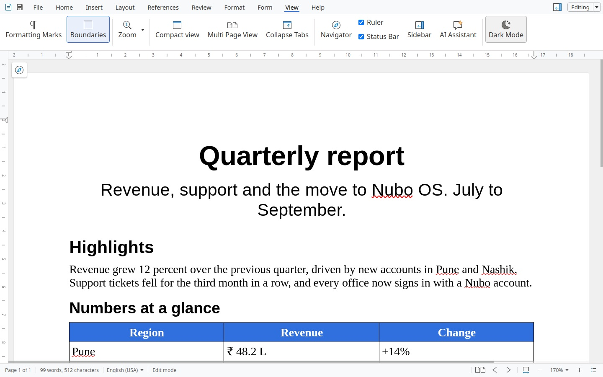

All the display options are in the **View** tab of every app.

## Dark and light

Nubo Office opens in a dark window on a dark system. Choose **Dark Mode** in the View tab to switch between the dark and the light theme. The accent stays the colour of the app: blue, green, orange or violet.

**Invert Background** turns the page background itself, white to dark and the other way, which helps when you read for a long time.

## What the View tab has

| Option | What it does | Apps |
|---|---|---|
| **Formatting Marks** | Shows paragraph marks and spaces | Write |
| **Boundaries** | Shows the borders of the text area | Write |
| **Zoom**, **Zoom In**, **Zoom Out**, **Reset zoom** | Change how large the page is | All |
| **Compact view** | Shrinks the ribbon to save room | All |
| **Multi Page View** | Shows several pages side by side | Write |
| **Collapse Tabs** | Hides the ribbon until you click a tab | All |
| **Navigator** | Opens the document navigator | Write, Cells, Draw |
| **Ruler**, **Status Bar** | Show or hide the ruler and the status bar | Write, Present, Draw |
| **Sidebar** | Shows or hides the sidebar on the right | All |
| **Full Screen** | Fills the screen with the document | Present, Draw |
| **Slide Views** | Switches how slides are shown | Present |
| **Grid** | Shows a grid to line things up | Cells, Present, Draw |
| **Freeze**, **Focus Cell**, **Sheet View** | Keep headings in view, highlight the current cell, change how the sheet is shown | Cells |

## Editing and viewing

The button at the top right shows **Editing** or **Viewing**. A file opened from outside can start in Viewing, which shows the page without the ribbon. Choose **Editing Mode** from the button to change it.

## Verify

Open **View**, then **Dark Mode**. The window changes between dark and light.

## See also

- [Accessibility](/office/features/accessibility/)
