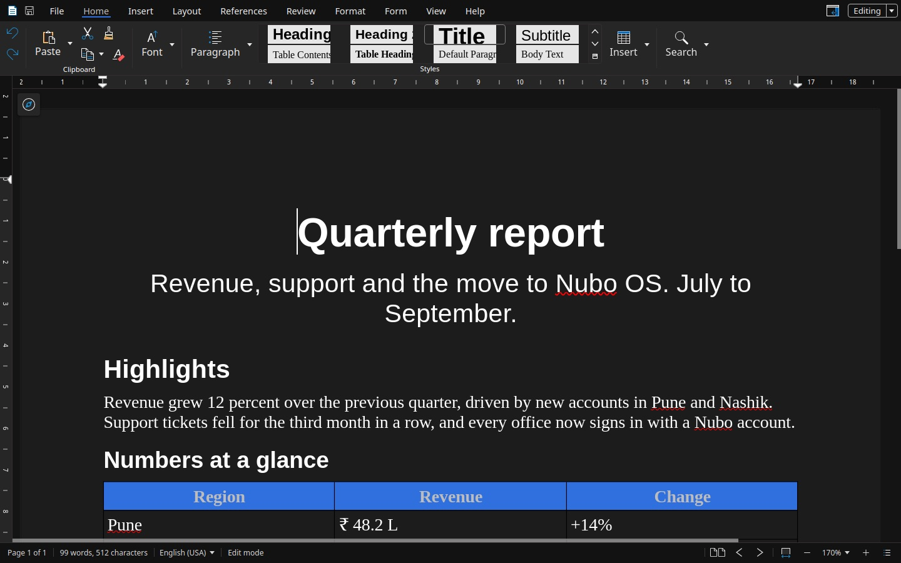

Nubo Write is for anything made of paragraphs: letters, reports, essays, forms. It opens `.docx`, `.doc`, `.odt`, `.rtf` and `.txt` files. The colour is blue.

## The window

- **Tabs** along the top: File, Home, Insert, Layout, References, Review, Format, Form, View and Help.
- **Ribbon** under the tabs, with the tools of the tab you chose.
- **Ruler** above and beside the page.
- **Page** in the middle. The compass button at the top left opens the Navigator.
- **Sidebar** on the right with Style, Character and Paragraph settings for the selection.
- **Status bar** along the bottom: the page count, the number of words and characters, the language, and the edit mode.
- **Editing** button at the top right switches between editing and viewing.

## The tabs

| Tab | What it is for |
|---|---|
| **Home** | The clipboard, Font and Paragraph settings, the gallery of styles (Title, Subtitle, Heading, Body Text, Table Contents and more), Insert and Search |
| **Insert** | Page Break, Title Page, Table, Image, Shapes, Line, Chart, Hyperlink, Comment, Header, Footer, Page Number, Field, Section, Text, Formatting Mark and Symbols |
| **Layout** | Margin, Size, Orientation, Columns, breaks, Hyphenation, Line Numbering, Watermark, and how objects wrap, align and arrange |
| **References** | Table of Contents and Index, Footnote, Endnote, Bookmark, Cross-reference, Field and Update All |
| **Review** | Word Count, Thesaurus, Language, spell check, Comment, Show Comments, Tracking, Compare and Accessibility Check |
| **Format** | Character, Paragraph, Style list, Lists/Bullets, Page Style, Columns, Sections, Line, Position and Size, Heading Numbering, Name, Alt Text and Theme |
| **Form** | Rich Text, Checkbox, Dropdown, Picture, Date and Properties |
| **View** | Formatting Marks, Boundaries, Zoom, Compact view, Multi Page View, Collapse Tabs, Navigator, Ruler, Status Bar, Sidebar, Dark Mode and Invert Background |
| **Help** | Online Help, Keyboard shortcuts, Forum, Report an issue, Latest Updates, Screen Reading, Accessibility Check and About |

Every button is listed, group by group, in the [Nubo Write ribbon reference](/office/reference/ribbon-write/).

## What you can do

- **Style a document.** Apply Title, Subtitle and Heading styles from the Home tab. Change fonts, sizes and spacing in the sidebar, or with Format.
- **Tables.** Add one from Insert, then format its cells. See [Write your first document](/office/guides/write-first-document/).
- **Pages.** Set margins, page size, orientation and columns in Layout. Add a header, a footer and page numbers from Insert. See [Page layout, headers and footers](/office/guides/write-page-layout/).
- **Tables of contents, footnotes and cross-references** from References. See [Add a table of contents](/office/guides/write-table-of-contents/).
- **Review with other people.** Comments, tracked changes and a comparison of two versions live in Review. See [Review with comments and tracked changes](/office/guides/write-review-with-others/).
- **Forms.** Add checkboxes, dropdowns and date pickers. See [Make a form](/office/guides/write-forms/).
- **Check your work.** Spelling, a thesaurus, a word count and an accessibility check.

## Verify

Type a line, select it and choose **Title** in the Home tab. The line takes the title style.

## See also

- [Nubo Write ribbon reference](/office/reference/ribbon-write/)
- [Keyboard shortcuts](/office/reference/keyboard-shortcuts/)
