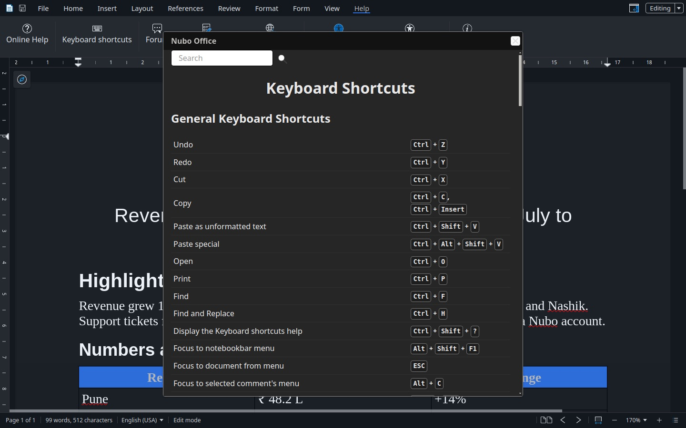

The full list is inside the apps: **Help**, then **Keyboard shortcuts**, or <kbd>Ctrl</kbd>+<kbd>Shift</kbd>+<kbd>?</kbd>. It has a search box. This page gives the ones you will use most.

## In every app

| Action | Keys |
|---|---|
| Undo | <kbd>Ctrl</kbd>+<kbd>Z</kbd> |
| Redo | <kbd>Ctrl</kbd>+<kbd>Y</kbd> |
| Cut | <kbd>Ctrl</kbd>+<kbd>X</kbd> |
| Copy | <kbd>Ctrl</kbd>+<kbd>C</kbd> or <kbd>Ctrl</kbd>+<kbd>Insert</kbd> |
| Paste as unformatted text | <kbd>Ctrl</kbd>+<kbd>Shift</kbd>+<kbd>V</kbd> |
| Paste special | <kbd>Ctrl</kbd>+<kbd>Alt</kbd>+<kbd>Shift</kbd>+<kbd>V</kbd> |
| Open | <kbd>Ctrl</kbd>+<kbd>O</kbd> |
| Print | <kbd>Ctrl</kbd>+<kbd>P</kbd> |
| Find | <kbd>Ctrl</kbd>+<kbd>F</kbd> |
| Find and Replace | <kbd>Ctrl</kbd>+<kbd>H</kbd> |
| Show the shortcuts help | <kbd>Ctrl</kbd>+<kbd>Shift</kbd>+<kbd>?</kbd> |
| Move focus to the ribbon | <kbd>Alt</kbd>+<kbd>Shift</kbd>+<kbd>F1</kbd> |
| Back to the document from the menu | <kbd>Esc</kbd> |
| Open the context menu | <kbd>Shift</kbd>+<kbd>F10</kbd> |
| Move focus to the next area (menu, document, sidebar, status bar) | <kbd>F6</kbd> |
| Move focus to the previous area | <kbd>Shift</kbd>+<kbd>F6</kbd> |

Bold, italic, underline, save and select all use the usual keys, <kbd>Ctrl</kbd>+<kbd>B</kbd>, <kbd>I</kbd>, <kbd>U</kbd>, <kbd>S</kbd> and <kbd>A</kbd>. The in-app page shows them next to each action.

## Nubo Write

| Action | Keys |
|---|---|
| Default paragraph style | <kbd>Ctrl</kbd>+<kbd>0</kbd> |
| Heading 1 to Heading 5 | <kbd>Ctrl</kbd>+<kbd>1</kbd> to <kbd>Ctrl</kbd>+<kbd>5</kbd> |
| Line break | <kbd>Shift</kbd>+<kbd>Enter</kbd> |
| New paragraph before or after a section or table | <kbd>Alt</kbd>+<kbd>Enter</kbd> |
| Start of the document | <kbd>Ctrl</kbd>+<kbd>Home</kbd> |
| End of the document | <kbd>Ctrl</kbd>+<kbd>End</kbd> |
| Word to the left or right | <kbd>Ctrl</kbd>+<kbd>←</kbd> or <kbd>→</kbd> |
| Select by word | <kbd>Ctrl</kbd>+<kbd>Shift</kbd>+<kbd>←</kbd> or <kbd>→</kbd> |
| Delete to the start or end of a word | <kbd>Ctrl</kbd>+<kbd>Backspace</kbd> or <kbd>Ctrl</kbd>+<kbd>Del</kbd> |
| Switch between text and header, or footer | <kbd>Ctrl</kbd>+<kbd>PageUp</kbd>, <kbd>Ctrl</kbd>+<kbd>PageDown</kbd> |

## Nubo Cells

| Action | Keys |
|---|---|
| First cell (A1) | <kbd>Ctrl</kbd>+<kbd>Home</kbd> |
| Last cell with data | <kbd>Ctrl</kbd>+<kbd>End</kbd> |
| Start or end of the row | <kbd>Home</kbd>, <kbd>End</kbd> |
| Next or previous sheet | <kbd>Ctrl</kbd>+<kbd>Alt</kbd>+<kbd>PageDown</kbd>, <kbd>Ctrl</kbd>+<kbd>Alt</kbd>+<kbd>PageUp</kbd> |
| Select the column | <kbd>Ctrl</kbd>+<kbd>Space</kbd> |
| Select the row | <kbd>Shift</kbd>+<kbd>Space</kbd> |
| Fill down | <kbd>Ctrl</kbd>+<kbd>D</kbd> |
| Set optimal column width | <kbd>Ctrl</kbd>+<kbd>3</kbd> |
| Insert cells | <kbd>Ctrl</kbd>+<kbd>+</kbd> |
| Delete cells | <kbd>Ctrl</kbd>+<kbd>-</kbd> |
| Show the comment | <kbd>Ctrl</kbd>+<kbd>F1</kbd> |
| Insert the date | <kbd>Ctrl</kbd>+<kbd>;</kbd> |

## Nubo Present and Nubo Draw

| Action | Keys |
|---|---|
| Leave a text box and select the object | <kbd>Esc</kbd> |
| Select the next object | <kbd>Tab</kbd> |
| Select the previous object | <kbd>Shift</kbd>+<kbd>Tab</kbd> |
| Move to the next text object | <kbd>Ctrl</kbd>+<kbd>Enter</kbd> |
| Select all on the slide or page | <kbd>Ctrl</kbd>+<kbd>A</kbd> |
| Demote or promote a list item | <kbd>Tab</kbd>, <kbd>Shift</kbd>+<kbd>Tab</kbd> |

## Tables in Nubo Write

| Action | Keys |
|---|---|
| Next cell | <kbd>Tab</kbd> |
| Select the cell or the whole table | <kbd>Ctrl</kbd>+<kbd>A</kbd> |
| Change column or row size | <kbd>Alt</kbd>+arrow keys |

## See also

- [Help inside the apps](/office/use/help-menu/)
